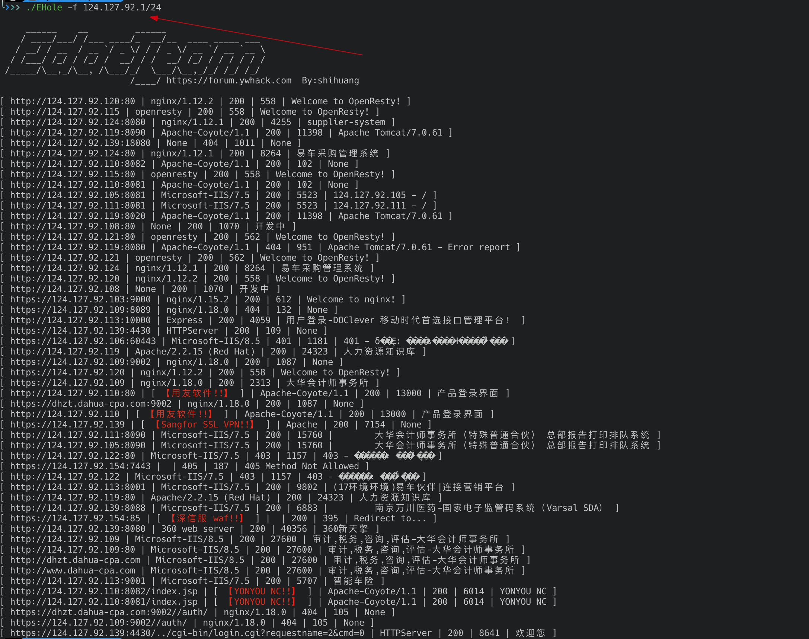

# EHole(棱洞)-红队重点攻击系统指纹探测工具

## 一、简介：

```bash
     ______    __         ______
    / ____/___/ /___ ____/_  __/__  ____ _____ ___
   / __/ / __  / __ `/ _ \/ / / _ \/ __ `/ __ `__ \
  / /___/ /_/ / /_/ /  __/ / /  __/ /_/ / / / / / /
 /_____/\__,_/\__, /\___/_/  \___/\__,_/_/ /_/ /_/
			 /____/ https://forum.ywhack.com  By:shihuang         
```

   EHole是一款对资产中重点系统指纹识别的工具，在红队作战中，信息收集是必不可少的环节，如何才能从大量的资产中提取有用的系统(如OA、VPN、Weblogic...)。EHole旨在帮助红队人员在信息收集期间能够快速从C段、大量杂乱的资产中精准定位到易被攻击的系统，从而实施进一步攻击。

## 二、使用：

```bash
EHole version: 0.0.1
Usage: nginx [-f|-l] [parameter]

Options:
  -f string
    	Fofa searches for assets , supports IP and IP segments。(192.168.1.1 | 192.168.1.0/24)
  -h	this help
  -l string
    	Probe based on local file
```

EHole提供了**两种**指纹识别方式，可从本地读取识别，也可以从FOFA进行批量调用API识别(需要FOFA密钥)。

**1.本地识别：**

```bash
EHole -l url.txt
```

PS:URL.txt内每行一个地址，需带上协议。

**2.FOFA识别：**

注意：从FOFA识别需要配置FOFA 密钥以及邮箱，在config.ini内配置好密钥以及邮箱即可使用。

```bash
Email=webmaster@chinacrack.com
Fofa_token=xxx
```

```bash
EHole -f 192.168.1.1/24  //支持单IP或IP段
```

## 三、效果：

**1.本地识别：**


**2.fofa识别：**




